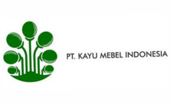
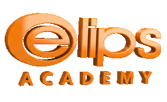
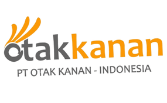

  

  <h1>Bagus Batra</h1>

  

    <b>Web Developer &amp; Programming Mentor</b> 
    Saya membangun sistem internal dan tooling produksi di lingkungan SAP, 
    dan mengajar Web &amp; Python Programming di Elips Academy.
  

  

    
    
    
    
    <!-- Pertimbangkan mengganti tombol WhatsApp dengan email. Nomor HP di README publik = magnet spam. -->
    
  

---

## Tentang Saya

Saya seorang web developer yang berfokus pada **sistem internal perusahaan** — pelaporan, monitoring, dan tooling yang dipakai tim operasional setiap hari. Sebagian besar pekerjaan saya bersinggungan dengan ekosistem **SAP** di lingkungan manufaktur.

Di luar itu, saya mengajar. Sudah lebih dari satu tahun saya membimbing siswa Web dan Python Programming di Elips Academy, dan sebagian repositori di sini adalah materi ajar yang saya susun sendiri.

- 🔭 Sedang mengerjakan tooling pelaporan dan monitoring berbasis SAP
- 🌱 Sedang mendalami React + TypeScript dan arsitektur API
- 👨‍🏫 Terbuka untuk kolaborasi proyek maupun kerja sama pengajaran
- 💬 Silakan hubungi saya soal Laravel, PHP, Python, atau integrasi data SAP

---

## Tech Stack

**Backend**

  
  
  

**Frontend**

  
  
  
  
  

**Database &amp; Tools**

  
  
  
  
  

**AI Tools**

  
  
  

---

## Proyek Pilihan

| Proyek | Ringkasan | Stack |
|---|---|---|
| **[GL Reporting — Talenta × SAP](https://github.com/bagusbatra/GL_Reporting_Talenta_SAP)** | Menjembatani data Talenta dengan SAP untuk menghasilkan laporan General Ledger secara otomatis, menggantikan proses rekap manual. | Laravel, Blade, MySQL |
| **[Revenue Monitoring Room](https://github.com/bagusbatra/revenue-monitoring-room)** | Dashboard pemantauan pendapatan yang menyajikan angka operasional secara real-time untuk keperluan tim manajemen. | Python |
| **[PurchaseOrder-PurchaseRequisition_SAP](https://github.com/bagusbatra/PurchaseOrder-PurchaseRequisition_SAP)** | Dashboard kebutuhan approval/view-only sistem Purchase Order dan Purchase Requisition integrasi data dari SAP. | HTML, JavaScript |
| **[Central Storage](https://github.com/bagusbatra/central-storage)** | Sistem dashboard penyimpanan dan distribusi material terpusat untuk kebutuhan produksi lintas tim. | HTML, JavaScript |
| **[Web Programming Fundamental](https://github.com/bagusbatra/web-programming-fundamental)** | Kurikulum belajar web programming untuk pemula: HTML, CSS, dan JavaScript disusun bertahap lengkap dengan latihan dan proyek. | HTML, CSS, JavaScript |
| **[Git Dasar](https://github.com/bagusbatra/git-dasar)** | Materi pengenalan Git dan GitHub sebagai sistem kontrol versi, ditulis untuk siswa yang baru pertama kali menyentuh version control. | Git, Markdown |

---

## Pengalaman

**ERP &amp; IT Programmmer** — PT. Kayu Mebel Indonesia · 2026
Mengintegrasikan sumber data lintas modul SAP dengan kebutuhan operasional harian perusahaan melalui integrasi sumber data yang terpisah, otomatisasi penyusunan laporan, dan pengembangan antarmuka yang membuat data ERP dapat diakses oleh pengguna non-teknis..

 

**Web &amp; Python Programming Mentor** — Elips Academy · 2025
Membimbing siswa dari nol hingga mampu membangun aplikasi web sendiri. Lebih dari satu tahun pengalaman mengajar, dengan fokus pada praktik nyata: alur kerja developer, penggunaan Git, dan penyelesaian masalah yang benar-benar ditemui di lapangan.

 

**Web Developer Intern** — PT Otak Kanan · 2022
Enam bulan mengembangkan dan memelihara sistem berbasis web, sekaligus pengalaman pertama saya bekerja dalam tim pengembangan profesional.

 

---

## Pendidikan

**D3 Teknologi Informasi** — Politeknik Negeri Madiun
IPK 3.48 · Fokus pada pengembangan web

---

## GitHub Activity

  

---

  <h3>Punya proyek yang ingin dikerjakan bersama?</h3>
  
Saya terbuka untuk diskusi — silakan hubungi lewat LinkedIn atau email.

  

###

  

###